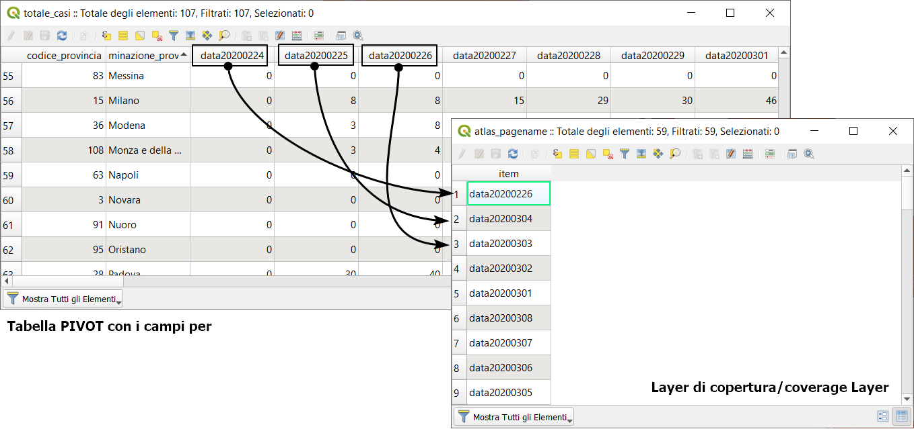
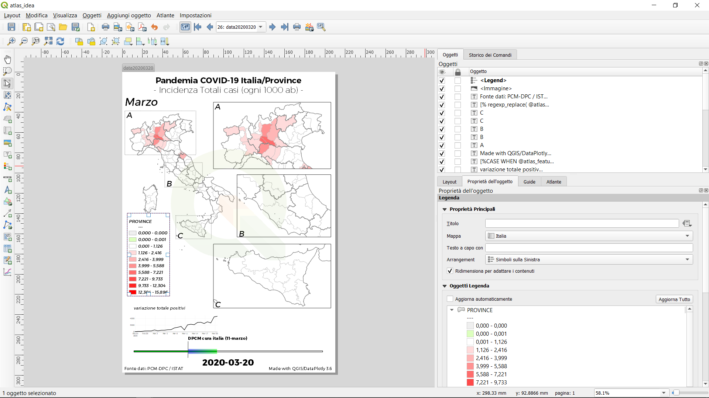
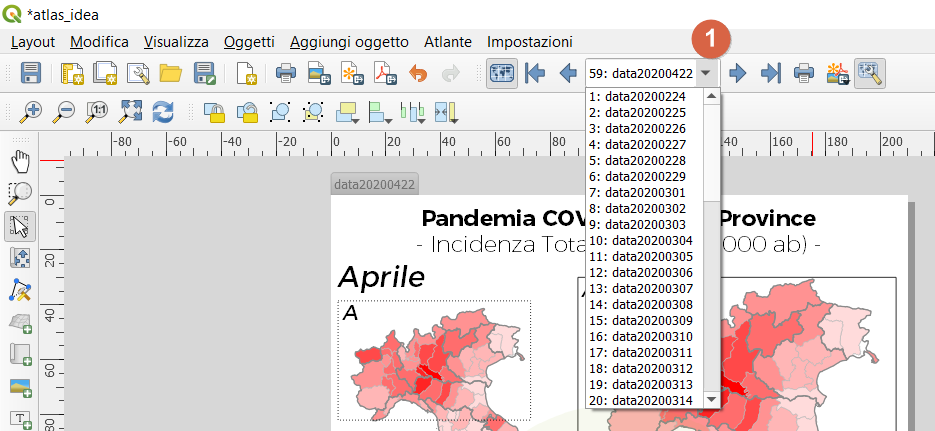
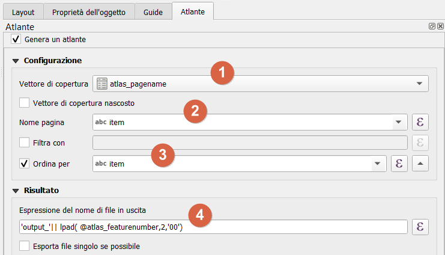
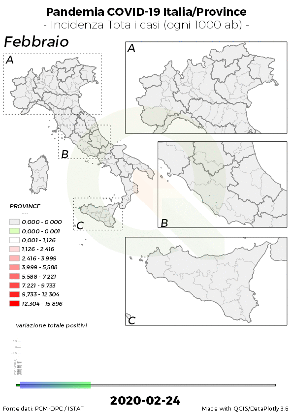
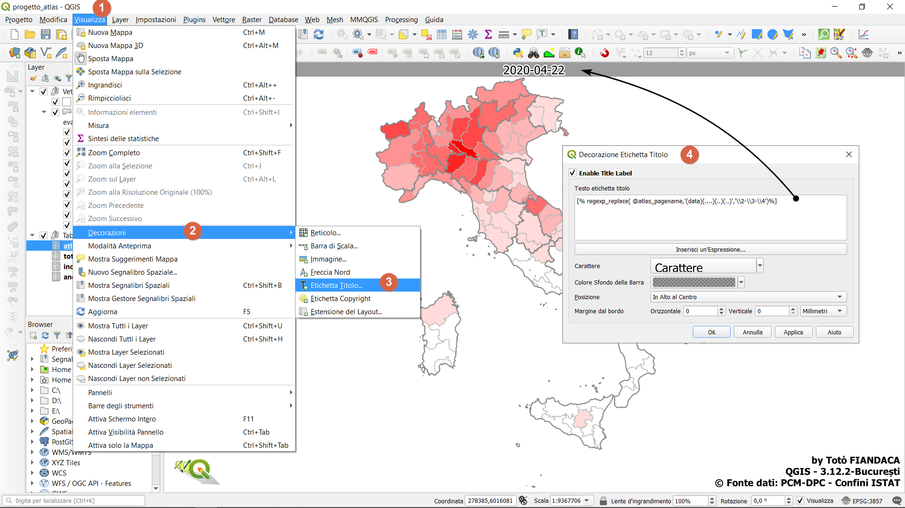
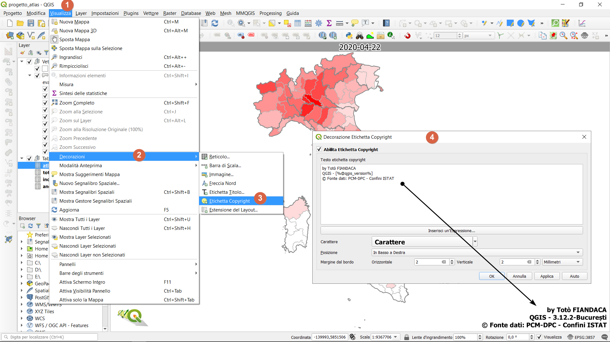

# QGIS Atlante per campi

Generare un atlante per campi / Generate an atlas for fields

<!-- TOC -->

- [QGIS Atlante per campi](#qgis-atlante-per-campi)
  - [Perché questo repository](#perch%c3%a9-questo-repository)
  - [Software](#software)
  - [layer nella TOC](#layer-nella-toc)
  - [progetti QGIS](#progetti-qgis)
  - [atlas](#atlas)
  - [stampe](#stampe)
  - [Varie](#varie)
    - [decorazione 1](#decorazione-1)
    - [decorazione 2](#decorazione-2)
  - [Riferimenti](#riferimenti)
  - [Ringraziamenti](#ringraziamenti)
  - [Licenza](#licenza)

<!-- /TOC -->

## Perché questo repository

Per documentare un esempio poco noto di Atlas per campi con dati e progetto. <br>L'atlante di **QGIS** si basa sulla definizione del `layer di copertura` e crea tante pagine quante sono le feature del layer. **QGIS** permette di utilizzare, come Coverage layer, anche semplici tabelle senza geometria come il caso in esame.



## Software

- QGIS 3.12.2 București
- Plugin DataPlotly 3.6

## layer nella TOC

nome file | layer rinominato nella TOC | usato per
----------|----------------------------|----------
`covid19-andamento_nazione.vrt` | `andamento_nazionale`| alimentare il grafico nell'Atlas
`incidenza1k_totale_casi_prov_pivot_dw.csv` | `incidenza1k`| mettere in JOIN con `province`
`totale_casi_prov_pivot_dw`|`totale_casi`| mettere in JOIN con `province`
`province_ita` | `province`| visualizzare i vettore tematizzati
`regioni_ita_mod` | `regioni`| visualizzare i confini regionali
`atlas_pagename`|-|alimentare il `Layer di Copertura`

[↑ torna su ↑](#qgis-atlante-per-campi)

## progetti QGIS

- `progetto_base.qgs` - progetto con solo i layer caricati - EPSG progetto 3857;
- `progetto_atlas.qgs` - progetto con atlas per campi - EPSG progetto 3857.


## atlas







qui template: `qgis_atlas_for_fields/risorse/atlas.qpt` <https://github.com/pigreco/qgis_atlas_for_fields/blob/master/risorse/atlas.qpt>

## stampe

Ho realizzato l’output dell’atlante per creare due cose:

- la griglia di immagini;
- una gif animata che mostri le variazioni nel tempo.


Per farlo, ho esportato le pagine dell’atlante in PNG e le ho elaborate con [ImageMagick](https://imagemagick.org/).

La **griglia** creata con l’utility `montage`, con il comando:

```
 montage output_*.png -tile 8x8 -geometry +5+5 atlas_montage2.png
```


[↑ torna su ↑](#qgis-atlante-per-campi)

La **gif animata** sfruttando l’utility `convert`, con il comando:

```
convert -delay 50  output_*.png -loop 0 atlas.gif
```



[↑ torna su ↑](#qgis-atlante-per-campi)

## Varie

### decorazione 1

etichetta

esempio regex: https://regex101.com/r/vKdQJh/1

espressione usata:

```
regexp_replace( @atlas_pagename,'(data)(....)(..)(..)','\\2-\\3-\\4')
```



### decorazione 2

espressione copyright progetto QGIS

```
by Totò FIANDACA
QGIS - [%@qgis_version%]
© Fonte dati: PCM-DPC - Confini ISTAT
```


[↑ torna su ↑](#qgis-atlante-per-campi)

## Riferimenti

- [QGIS](https://qgis.org/it/site/)
- [data.word](https://data.world/)
- [Notepad++](https://notepad-plus-plus.org/downloads/)
- [Visual Studio Code](https://code.visualstudio.com/)
- [ImageMagick](https://imagemagick.org/)
- [PCM-DPC](https://github.com/pcm-dpc/COVID-19)
- [Post su Medium by Andrea Borruso](https://medium.com/tantotanto/qgis-generare-un-atlante-basato-su-campi-4eeff34b3900)
- [ISTAT](https://www.istat.it/it/archivio/222527)
- [HfcQGIS](http://hfcqgis.opendatasicilia.it/it/latest/)
- [Blog post su Pigrecoinfinito](https://pigrecoinfinito.com/qgis-creare-un-atlas-inconsueto/)

## Ringraziamenti

- [**Andrea Borruso**](https://twitter.com/aborruso) grazie mille, sempre.

## Licenza

**CC BY-SA 4.0** [visualizza licenza](https://creativecommons.org/licenses/by-sa/4.0/deed.it)

[↑ torna su ↑](#qgis-atlante-per-campi)

