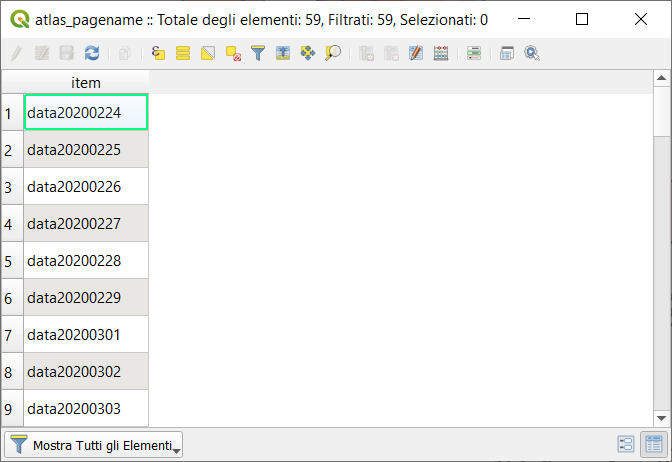

# file cartelle

<!-- TOC -->

- [file cartelle](#file-cartelle)
  - [covid19-andamento_nazione.vrt](#covid19-andamentonazionevrt)
  - [dpc-covid19-ita-province.vrt](#dpc-covid19-ita-provincevrt)
  - [pop_res_prov107.vrt](#popresprov107vrt)
  - [totale_casi_prov_pivot_dw.csv](#totalecasiprovpivotdwcsv)
  - [incidenza1k_totale_casi_prov_pivot_dw.csv](#incidenza1ktotalecasiprovpivotdwcsv)
  - [atlas_pagename.csv](#atlaspagenamecsv)
  - [altri file](#altri-file)

<!-- /TOC -->

## covid19-andamento_nazione.vrt

È un file virtuale dove forzo il tipo di campo. Contine i dati `andamento nazionale` prodotto dal [PCM-DPC](https://github.com/pcm-dpc/COVID-19)

```xml
<OGRVRTDataSource>
<OGRVRTLayer name="dpc-covid19-ita-andamento-nazionale">
    <SrcDataSource relativeToVRT="0">/vsicurl/https://raw.githubusercontent.com/pcm-dpc/COVID-19/master/dati-andamento-nazionale/dpc-covid19-ita-andamento-nazionale.csv</SrcDataSource>
    <Field name="data" type="String" />
    <Field name="stato" type="String" />
	<Field name="ricoverati_con_sintomi" type="Integer" />
    <Field name="terapia_intensiva" type="Integer" />
    <Field name="totale_ospedalizzati" type="Integer" />
    <Field name="isolamento_domiciliare" type="Integer" />
    <Field name="totale_positivi" type="Integer" />
	<Field name="variazione_totale_positivi" type="Integer" />
    <Field name="nuovi_positivi" type="Integer" />
    <Field name="dimessi_guariti" type="Integer" />
    <Field name="deceduti" type="Integer" />
    <Field name="totale_casi" type="Integer" />
    <Field name="tamponi" type="Integer" />
	<Field name="note_it" type="String" />
	<Field name="note_en" type="String" />
</OGRVRTLayer>
</OGRVRTDataSource>
```

## dpc-covid19-ita-province.vrt

È un file virtuale dove forzo il tipo di campo. Contine i dati `province` prodotto dal [PCM-DPC](https://github.com/pcm-dpc/COVID-19)

```xml
<OGRVRTDataSource>
<OGRVRTLayer name="dpc-covid19-ita-province">
    <SrcDataSource relativeToVRT="0">/vsicurl/https://raw.githubusercontent.com/pcm-dpc/COVID-19/master/dati-province/dpc-covid19-ita-province.csv</SrcDataSource>
    <Field name="data" type="Datetime" />
	<Field name="stato" type="String" />
	<Field name="codice_regione" type="String" />
	<Field name="denominazione_regione" type="String" />
	<Field name="codice_provincia" type="String" />
	<Field name="denominazione_provincia" type="String" />
	<Field name="sigla_provincia" type="String" />
	<Field name="totale_casi" type="Integer" />
	<Field name="note_it" type="String" />
	<Field name="note_en" type="String" />
</OGRVRTLayer>
</OGRVRTDataSource>
```

## pop_res_prov107.vrt

È un file virtuale dove forzo il tipo di campo. Contine i dati `popolazione residente province a 107 ISTAT 01-01-2019` prodotto dal [ISTAT](https://www.istat.it/)

```xml
<OGRVRTDataSource>
<OGRVRTLayer name="pop_res_prov_NUTS3_ISTAT20190101">
    <SrcDataSource relativeToVRT="0">/vsicurl/https://gist.githubusercontent.com/pigreco/62233a37dd505fc25b06acc570bffed6/raw/50b677c33481352419c53114f6a2d0a3b2898c7c/pop_res_prov_NUTS3_ISTAT20190101.csv</SrcDataSource>
    <Field name="NUTS3" type="String" />
	<Field name="cod_reg" type="Integer" />
	<Field name="COD_UTS_AM" type="String" />
	<Field name="COD_UTS_ST" type="String" />
	<Field name="DEN_UTS" type="String" />
	<Field name="TIPO_UTS" type="String" />
	<Field name="Sigla" type="String" />
	<Field name="COD_PROV_Storico" type="String" />
	<Field name="province" type="String" />
	<Field name="pop_res" type="Integer" />
</OGRVRTLayer>
</OGRVRTDataSource>
```

## totale_casi_prov_pivot_dw.csv

È un file CSV risultato della seguente query su `data.world` (tabella PIVOT):

```sql
WITH andamentoProvince AS (
    SELECT CAST(a.codice_provincia as STRING), a.denominazione_provincia ,
                "data"||CAST(DATE_FORMAT(CAST(data AS DATE), "yyyyMMdd") as STRING) AS datee, 
                a.totale_casi 
                FROM dpc_covid19_ita_province a
                WHERE a.denominazione_provincia  NOT LIKE "In fase di%"
    ORDER BY data
)
SELECT *
  FROM andamentoProvince
PIVOT (MAX(totale_casi) FOR datee IN ("data20200224","data20200225","data20200226","data20200227","data20200228","data20200229","data20200301","data20200302","data20200303","data20200304","data20200305","data20200306","data20200307","data20200308","data20200309","data20200310","data20200311","data20200312","data20200313","data20200314","data20200315","data20200316","data20200317","data20200318","data20200319","data20200320","data20200321","data20200322","data20200323","data20200324","data20200325","data20200326","data20200327","data20200328","data20200329","data20200330","data20200331","data20200401","data20200402","data20200403","data20200404","data20200405","data20200406","data20200407","data20200408","data20200409","data20200410","data20200411","data20200412","data20200413","data20200414","data20200415","data20200416","data20200417","data20200418","data20200419","data20200420","data20200421","data20200422"));
```

dove `dpc_covid19_ita_province` è il file CSV prodotto da [PCM-DPC](https://github.com/pcm-dpc/COVID-19)

## incidenza1k_totale_casi_prov_pivot_dw.csv

È un file CSV risultato della seguente query su `data.world` (tabella PIVOT):

```SQL
WITH andamentoProvince AS (
    SELECT  a.denominazione_provincia ,
            "data"||CAST(DATE_FORMAT(CAST(data AS DATE), "yyyyMMdd") as STRING) AS datee, 
            a.incidenza1kab 
            FROM totaleCasiIncidenza1kab a
            WHERE a.denominazione_provincia  NOT LIKE "In fase di%"
    ORDER BY data
)
SELECT *
  FROM andamentoProvince
PIVOT (MAX(incidenza1kab) FOR datee IN ("data20200224","data20200225","data20200226","data20200227","data20200228","data20200229","data20200301","data20200302","data20200303","data20200304","data20200305","data20200306","data20200307","data20200308","data20200309","data20200310","data20200311","data20200312","data20200313","data20200314","data20200315","data20200316","data20200317","data20200318","data20200319","data20200320","data20200321","data20200322","data20200323","data20200324","data20200325","data20200326","data20200327","data20200328","data20200329","data20200330","data20200331","data20200401","data20200402","data20200403","data20200404","data20200405","data20200406","data20200407","data20200408","data20200409","data20200410","data20200411","data20200412","data20200413","data20200414","data20200415","data20200416","data20200417","data20200418","data20200419","data20200420","data20200421","data20200422"));
```

dove `totaleCasiIncidenza1kab` è la seguente query:

```sql
SELECT a.data, a.totale_casi,
       a.denominazione_provincia,
       a.sigla_provincia,b.pop_res, 
       (a.totale_casi/b.pop_res)*1000 AS incidenza1kab
FROM dpc_covid19_ita_province a, pop_res_prov107_NUTS3_ISTAT20190101_cod_reg b
WHERE a.sigla_provincia = b.sigla;
```

dove: `dpc_covid19_ita_province` è il file CSV prodotto da [PCM-DPC](https://github.com/pcm-dpc/COVID-19) e `pop_res_prov107_NUTS3_ISTAT20190101_cod_reg` è la tabella che contiene la popolazione residente.

## atlas_pagename.csv

È un file CSV da generare utilizzando le intestazioni dei campi della tabella PIVOT, 


## altri file

- `grafico.xml` file configurazione grafico;
- `atlas.qpt` template layout di stampa;
